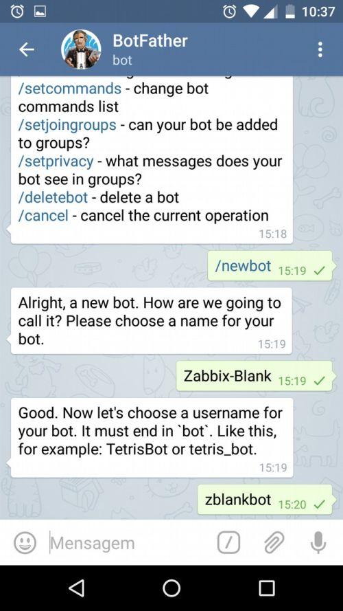

# telegram-notify-zabbix

# Zabbix Telegram integration
Inspired by https://github.com/diegosmaia/zabbix-telegram

Use this script to send message notification (text and graphs) from Zabbix to Telegram users
This is bash script, so is useful in case you can't install python libraries or php libraries on Zabbix server (for example in dockerized version of Zabbix server)

# How is work

Put the script in alertscript folder on Zabbix server and add a media type in the Zabbix GUI

# Install and configure instructions

## Telegram

A Telegram BOT is a special account in which can be possible use HTTP API to send messages, images ecc... to users that are connected to the BOT.
First of all, you have to create a Telegram BOT, from a normal Telegram account. So, you have to be already registered to Telegram.

From Telegram search the contact BotFather, press Start and the send message `/start`


Then send `/newbot` to create the BOT and answer to next question (name of BOT, BOT username).



Now, the BotFather send you the TokenID that you have to insert in zabbix-telegram.sh script


Search and add the created BOT to your contact, send message `/start`
Then go, on the browser, to the URL https://api.telegram.org/botTokenID/getUpdates
(please careful that before the TokenID there is the word *bot*)

In our example the URL is https://api.telegram.org/bot161080402:AAGah3HIxM9jUr0NX1WmEKX3cJCv9PyWD58/getUpdates


To get the userid to set in Zabbix user profile you have to send an example text (whatever) to BOT and go to the URL above. In the broser you see a message similar to this
`"message":{"message_id":59,"from":{"id":9083329,"first_name":"User Name","last_name":"User Lastname","username":"UsernameTelegram"},"chat":{"id":`

In this example the userid is *9083329*

You can add the created BOT to a group of users, so the BOT send the message to this group. In this case you have to catch the groupid in the same way.
The group id is id with a minus before, for example *-57169325*


## Script

Download the zabbix-telegram.sh from here and put in alertscript folder on Zabbix server.

Then open it and modify these settings:
 - ZBX_URL with the Zabbix address or URL
 - USERNAME and PASSWORD for access to Zabbix GUI (this user must have the permission to see the graph)
 - BOT_TOKEN with the TokenID obtained from BotFather
 - SEND_GRAPH and SEND_MESSAGE flag to enable the two features
 - ZABBIXVERSION34 if the version of Zabbix is >= 3.4.1
 - WIDTH to increase the width of graph image
 - PERIOD to set the seconds to see in the graph

If you want to test the script you can call from terminal in this way

`./zabbix-telegram.sh 9083329 "OK Disaster Subject" "Message Item Graphic: [10490]"`

where the 10490 is a item id and 9083329 is userid.


## Zabbix

First of all add the user, setting the correct permission to get the graph and configure it in the script.

Then add a media type


In the user profile add the Telegram media with userid and choose the severity


Then add a new action or edit the existing one:
 - in the subject have to insert this at beginning: `{TRIGGER.STATUS} {TRIGGER.SEVERITY}` ... (for example `{TRIGGER.STATUS} {TRIGGER.SEVERITY} {TRIGGER.NAME} on {HOST.NAME1}`)
 - in the message you can insert this
```
GroupName:{TRIGGER.HOSTGROUP.NAME} 
Hostname: {HOSTNAME}
Problem: {TRIGGER.NAME}:
Problem status: {STATUS}
Severity: {TRIGGER.SEVERITY}
Date and Time: {EVENT.DATE} - {EVENT.TIME}
Item Graphic: [{ITEM.ID1}]
Last tested value: {{HOSTNAME}:{TRIGGER.KEY}.last(0)}
```

Is important have *Item Graphic: [{ITEM.ID1}]* for the graph image function

